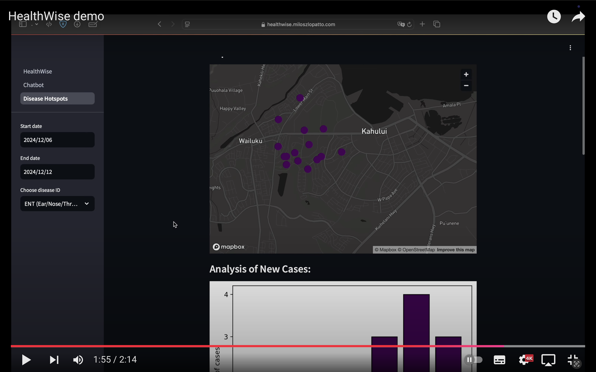

# HealthWise

**Multi-agent healthcare system: trusted health assistant for people, outbreak detector for health authorities.**

Main features:
- Multi-agent system (*LangGraph*, *LangChain*)
- Chatbot **responses** are **grounded ONLY on reliable sources**: 
    - nhs.uk
    - medlineplus.gov
    - cdc.gov
- Outbreak detector for health authorities - **analysis panel for health authorities** with visualisations and forecasting

## Demo video
[](https://youtu.be/qvGoYrBKTD4 "Watch the demo video")
***Click above to watch the demo video!***

### Presentation video
[](https://youtu.be/ZP9zoNelaC4 "Watch the presentation video")
***Click above to watch the presentation video!***

## Tech stack
- **Backend**: Python, FastAPI, LangGraph, LangChain
- **Frontend**: Streamlit
- **LLM**: OpenAI (gpt-4o and gpt-4o-mini)
- **Search engine**: Tavily
- **Visualisation**: Plotly
- **Virtual environment**: Matplotlib
- **Data storage**: MongoDB

## Security considerations
- The app is seperated into two parts: chatbot for people and analysis panel for health authorities.
    - Chatbot is public and can be used by anyone. **It can ONLY WRITE to the database, not read from it.**
    - Analysis panel is supposed to be accessed only by health authorities. **It can ONLY READ from the database.**

## Installation

### Requirements

- Poetry
- Filled `.env` file (copy `.env.example`, rename it, and fill in the missing API keys)

## Install dependencies

```bash
poetry install
```

If you encounter the error `ImportError: cannot import name 'TavilyClient' from 'tavily'`, run the following command:
```
pip install tavily-python
```
then run:
```bash
pip install --upgrade tavily-python
```

## Run the app

### Start the backend server
```bash
poetry shell
python backend/server.py
```

### Start the frontend app
```bash
streamlit run HealthWise.py
```

## Run pre-commit hooks

For now it's only black formatter.

```bash
pre-commit run --all-files
```